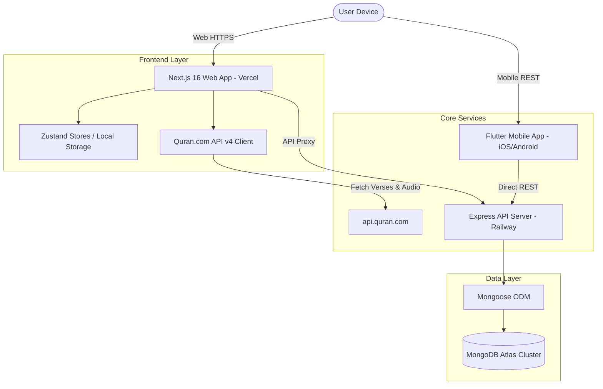

# TILAWA Project Memory & Technical Blueprint

> **Single Source of Truth (SSOT)** for the TILAWA / IQRA ecosystem.  
> Last updated: October 3, 2026

---

> [!CAUTION]
> ### Security Alerts & Rotation Required
> Live database credentials were previously committed in `apps/backend/server/MONGODB_SETUP.md`. The credentials have been redacted to `<REDACTED_USER>` and `<REDACTED_PASSWORD>`.  
> **Required Action:** The MongoDB Atlas cluster user credentials associated with `cluster0.wxno2ll.mongodb.net/tilawa` MUST be rotated immediately in the MongoDB Atlas dashboard.

---

## Table of Contents
1. [Project Overview](#1-project-overview)
2. [Current Status](#2-current-status)
3. [Tech Stack](#3-tech-stack)
4. [Architecture](#4-architecture)
5. [Features](#5-features)
6. [Authentication](#6-authentication)
7. [Database](#7-database)
8. [API Reference](#8-api-reference)
9. [Design System](#9-design-system)
10. [Environment Variables](#10-environment-variables)
11. [Setup and Run](#11-setup-and-run)
12. [Deployment](#12-deployment)
13. [Testing](#13-testing)
14. [Decisions Log](#14-decisions-log)
15. [Known Issues and Bugs](#15-known-issues-and-bugs)
16. [Roadmap / TODO](#16-roadmap--todo)
17. [Legal and Content Notes](#17-legal-and-content-notes)
18. [Changelog](#18-changelog)
19. [Glossary](#19-glossary)
20. [How to Update This File](#20-how-to-update-this-file)
21. [Documentation](#21-documentation)
22. [Open Questions](#22-open-questions)

---

## 1. Project Overview

**TILAWA** (also referred to as **TILAWA-IQRA**) is a multi-platform, production-grade Quranic learning & Islamic knowledge ecosystem. It combines a 604-page digital Madani Mushaf reader, verse-by-verse audio recitations, multi-lingual translations (15+ languages), Hadith & Dua libraries, Hifz memorization studio, Nafs habit tracker, Tajweed guidance, and an AI learning assistant (Zaid AI).

- **Goals:** Provide a distraction-free, authentic, beautifully typeset Quran reading and learning experience across Web, iOS, and Android.
- **Target Users:** Muslims worldwide, students of Quran & Tajweed, Huffaz (memorizers), and learners seeking authentic translations and Islamic resources.
- **Current Version:** Workspace `1.0.0`, Web Frontend `0.1.0` (Next.js 16), API Backend `0.1.0` (Express/Node), Mobile App `1.0.0+1` (Flutter).
- **Live Deployments:**
  - Web Application: [https://tilawaa.vercel.app](https://tilawaa.vercel.app)
  - Backend API: [https://tilawa-production.up.railway.app](https://tilawa-production.up.railway.app)
- **Repository:** [https://github.com/syedsz-1519/TILAWA-IQRA.git](https://github.com/syedsz-1519/TILAWA-IQRA.git)

---

## 2. Current Status

| Component / Module | Production Status | Completeness | Operational Details |
| :--- | :--- | :--- | :--- |
| **Web Frontend (Next.js 16)** | Deployed on Vercel | 95% | Fully functional App Router, Light Theme Mushaf Reader, Player Bar, Dashboard, Hadith/Dua libraries. |
| **API Backend (Express)** | Deployed on Railway | 85% | Express REST API connected to MongoDB via Mongoose. Handles products, languages, hifz progress, auth proxy. |
| **Mobile App (Flutter)** | Local / Pre-release | 75% | Full Flutter multi-platform codebase with Riverpod, Provider, Hive, and Dio network layer. |
| **Quran Reader (Mushaf Mode)** | Active | 95% | Standard 604-page Madani Mushaf layout with 15 lines per page, high-legibility typography, and jump navigation. |
| **Quran Reader (Surah Mode)** | Active | 95% | Surah-by-surah scrolling view with Arabic text, multi-translator options, and audio syncing. |
| **Audio Engine & Player** | Active | 90% | Global player bar, multi-reciter selection, Islam360-style interleaved Urdu audio playback. |
| **Hadith Library** | Active | 90% | Categorized collection browsing with search and bookmark capabilities. |
| **Dua & Adhkar Library** | Active | 90% | Daily adhkar strip, category browsing, and counters. |
| **Hifz Studio** | Active | 85% | Memorization tracking, revision schedule, and mastery cards. |
| **Nafs Tracker** | Active | 80% | Daily habit tracker for prayer, fasting, Quran reading minutes, and personal reflections. |
| **Zaid AI Assistant** | Active | 75% | Interactive Islamic learning assistant interface. |
| **Tajweed & Iqra** | Active | 85% | Interactive Tajweed rules guide, practice modules, and history of Quran. |

---

## 3. Tech Stack

### Web Frontend (`apps/web/frontend`)
- **Framework:** Next.js `16.2.6` (React `19.0.0`, App Router)
- **Language:** TypeScript `5.7.3`
- **Styling:** Tailwind CSS `4.2.0`, `@tailwindcss/postcss` `4.2.0`, `tw-animate-css` `1.4.0`
- **UI & Icons:** `@base-ui/react` `1.5.0`, `lucide-react` `1.16.0`, `clsx`, `tailwind-merge`
- **State & Data Fetching:** `zustand` `5.0.4` (persistent local stores), `swr` `2.4.2`
- **Authentication:** `better-auth` `1.6.23`

### Backend API (`apps/backend/server`)
- **Runtime & Framework:** Node.js, Express `4.18.2`
- **Execution & Language:** `tsx` `4.7.0`, TypeScript `5.7.3`
- **Database ORM/ODM:** Mongoose `8.8.0` (MongoDB)
- **Validation:** Zod `3.23.8`
- **Security & Utilities:** `bcryptjs` `2.4.3`, `jsonwebtoken` `9.0.2`, `helmet` `7.1.0`, `cors` `2.8.5`, `express-rate-limit` `7.1.5`, `pino` `9.5.0`

### Mobile App (`apps/mobile/tilawa`)
- **Framework:** Flutter `>=3.13.0` (Dart SDK `>=3.0.0 <4.0.0`)
- **State Management:** `flutter_riverpod` `2.4.0`, `provider` `6.0.0`
- **Networking & Persistence:** `dio` `5.3.0`, `retrofit` `4.0.0`, `hive_flutter` `1.1.0`, `sqflite` `2.3.0`, `shared_preferences` `2.2.2`
- **Audio & Router:** `just_audio` `0.9.31`, `go_router` `10.0.0`
- **Firebase & Security:** `firebase_core`, `firebase_auth`, `flutter_secure_storage` `9.0.0`

### Infrastructure & External APIs
- **Database:** MongoDB Atlas (Production), local MongoDB / Docker container for development.
- **Hosting:** Vercel (Web Frontend), Railway (Backend Server).
- **Containerization:** Docker multi-stage build & Docker Compose in `infrastructure/docker`.
- **External Data Services:** Quran.com API v4 (`api.quran.com`), Aladhan API (`api.aladhan.com`), Hadith API.

---

## 4. Architecture

### Workspace Directory Structure
```
TILAWA-IQRA/
├── apps/
│   ├── backend/
│   │   └── server/                 # Express.js REST API Server
│   │       ├── src/
│   │       │   ├── config/         # Environment, Logger, Database configs
│   │       │   ├── controllers/    # API Request Controllers
│   │       │   ├── db/             # Database connection & connection status
│   │       │   ├── models/         # Mongoose Schemas (User, Streak, Hifz, etc.)
│   │       │   ├── routes/         # Express Route definitions
│   │       │   └── utils/          # Security, token generation, response formatting
│   │       ├── package.json
│   │       └── MONGODB_SETUP.md
│   ├── mobile/
│   │   └── tilawa/                 # Flutter Mobile Application
│   │       ├── lib/                # Flutter screens, widgets, providers
│   │       └── pubspec.yaml
│   └── web/
│       └── frontend/               # Next.js 16 Web Application
│           ├── app/                # App Router pages and API proxy routes
│           │   ├── library/        # Quran library & Surah reader ([surahNumber])
│           │   ├── mushaf/         # 604-page Madani Mushaf page view
│           │   ├── read/           # Alternative Quran reader view
│           │   ├── hifz-studio/    # Memorization studio
│           │   ├── dua-library/    # Duas by category & search
│           │   ├── hadith-library/ # Hadith collections
│           │   ├── nafs-tracker/   # Habit & prayer logger
│           │   ├── zaid-ai/        # AI Assistant interface
│           │   ├── globals.css     # Light theme tokens & typography rules
│           │   └── layout.tsx      # Root app layout & navbar
│           ├── components/         # React components (SurahBanner, PlayerBar, etc.)
│           ├── lib/
│           │   └── quran/          # Quran API client, metadata, types
│           ├── store/              # Zustand state stores (reader settings)
│           └── package.json
├── docs/                           # Centralized documentation archives
│   ├── api/                        # API reference documentation
│   ├── architecture/               # System architecture specs
│   ├── auth/                       # Auth design documentation
│   └── deployment/                 # Vercel & Railway deployment guides
├── infrastructure/
│   └── docker/                     # Dockerfile and docker-compose.yml
├── memory.md                       # Single Source of Truth document
├── package.json                    # Monorepo root configuration
├── vercel.json                     # Vercel root build configuration
└── .env.example                    # Environment variable schema template
```

### Data & Request Flow
```
+-----------------------------------------------------------------------+
|                             USER CLIENT                               |
|        Next.js Web (Browser)    /    Flutter Mobile App (iOS/Android) |
+-----------------------------------+-----------------------------------+
                                    |
            +-----------------------+-----------------------+
            | HTTP / REST                                   | HTTP / REST
            v                                               v
+-----------------------+                       +-----------------------+
|  Quran.com API v4     |                       |  TILAWA API Server    |
| (Text, Verse Audio,   |                       | (Express.js/Railway)  |
|  Reciter Metadata)    |                       +-----------+-----------+
+-----------------------+                                   | Mongoose / ODM
                                                            v
                                                +-----------------------+
                                                |  MongoDB Atlas DB     |
                                                | (Users, Hifz, Streaks,|
                                                |  Bookmarks, Progress) |
                                                +-----------------------+
```

### Mermaid Architecture Diagram


---

## 5. Features

| Feature Name | Status | Key Source Files | Data Source |
| :--- | :--- | :--- | :--- |
| **604-Page Mushaf Reader** | Production | `app/mushaf/page.tsx`, `components/quran/MushafReader.tsx`, `lib/quran/api.ts` | Quran.com API v4 (Page endpoint) |
| **Surah Reader & Banner** | Production | `app/library/[surahNumber]/page.tsx`, `components/quran/SurahBanner.tsx` | Quran.com API v4 & local metadata (`meta.ts`) |
| **Global Audio Player** | Production | `components/player/player-bar.tsx`, `store/reader.ts` | EveryAyah / Quran.com CDN audio streams |
| **Multi-Language Translations** | Production | `lib/quran/api.ts`, `lib/languages.ts`, `components/multilingual/LanguageSelector.tsx` | Quran.com translation resource endpoint (15+ languages) |
| **Hadith Library** | Production | `app/hadith-library/page.tsx`, `app/hadith-library/[collectionId]/page.tsx` | Internal Hadith JSON dataset & Hadith API |
| **Dua & Adhkar Library** | Production | `app/dua-library/page.tsx`, `app/dua-adhkar/page.tsx` | `data/adhkar.json`, `lib/dua-data.ts` |
| **Hifz Memorization Studio** | Production | `app/hifz-studio/page.tsx`, `apps/backend/server/src/routes/hifz.ts` | MongoDB `HifzProgress` collection |
| **Nafs Habit Tracker** | Production | `app/nafs-tracker/page.tsx`, `apps/backend/server/src/models/NafsTracking.ts` | MongoDB `NafsTracking` collection |
| **Reading Progress & Streaks**| Production | `app/actions/streaks.ts`, `apps/backend/server/src/models/Streak.ts` | MongoDB `Streak` & `ReadingProgress` |
| **Zaid AI Assistant** | Beta | `app/zaid-ai/page.tsx` | Internal AI guidance client |
| **Tajweed Rules & Iqra** | Production | `app/iqra/page.tsx`, `app/tajweed/page.tsx`, `data/tajweed-rules.ts` | Internal Tajweed rules engine |

---

## 6. Authentication

### Current Mechanism
1. **Frontend Authentication Client:** Built using `better-auth` (`1.6.23`) mounted at `app/api/auth/[...all]/route.ts`. Provides fallback initialization secrets (`BETTER_AUTH_SECRET`) to prevent build-time crashes on Vercel when environment secrets are missing during static generation.
2. **Backend Express Auth:** Express server validates bearer tokens and cookies using standard JWT signed with `JWT_SECRET`.
3. **Password Security:** User passwords are hashed with `bcryptjs` (salt rounds: 10).
4. **Session Storage:** Tokens are stored in secure HTTP-only cookies (`tilawa-token`) or local storage headers for mobile endpoints.

### Gaps & Planned Improvements
- **OAuth Providers:** Google & GitHub sign-in endpoints require production client IDs and client secrets set in Vercel & Railway environment panels.
- **Token Rotation:** Refresh token handling for persistent mobile Flutter app sessions is undergoing active optimization.

---

## 7. Database

### MongoDB Collections & Mongoose Schemas (`apps/backend/server/src/models/`)

#### 1. User (`User.ts`)
```typescript
{
  name: { type: String, required: true },
  email: { type: String, required: true, unique: true, index: true },
  password: { type: String, required: true },
  role: { type: String, enum: ['user', 'admin'], default: 'user' },
  languagePreference: { type: String, default: 'en' },
  createdAt: { type: Date, default: Date.now },
  updatedAt: { type: Date, default: Date.now }
}
```

#### 2. ReadingProgress (`ReadingProgress.ts`)
```typescript
{
  userId: { type: Schema.Types.ObjectId, ref: 'User', required: true, index: true },
  surahNumber: { type: Number, required: true },
  ayahNumber: { type: Number, required: true },
  pageNumber: { type: Number, required: true },
  completionPercentage: { type: Number, default: 0 },
  updatedAt: { type: Date, default: Date.now }
}
```

#### 3. Bookmark (`Bookmark.ts`)
```typescript
{
  userId: { type: Schema.Types.ObjectId, ref: 'User', required: true, index: true },
  surahNumber: { type: Number, required: true },
  ayahNumber: { type: Number, required: true },
  pageNumber: { type: Number },
  note: { type: String },
  folder: { type: String, default: 'General' },
  createdAt: { type: Date, default: Date.now }
}
```

#### 4. Streak (`Streak.ts`)
```typescript
{
  userId: { type: Schema.Types.ObjectId, ref: 'User', required: true, unique: true },
  currentStreak: { type: Number, default: 0 },
  longestStreak: { type: Number, default: 0 },
  lastActiveDate: { type: Date },
  history: [{ date: Date, minutesRead: Number }]
}
```

#### 5. HifzProgress (`HifzProgress.ts`)
```typescript
{
  userId: { type: Schema.Types.ObjectId, ref: 'User', required: true, index: true },
  surahNumber: { type: Number, required: true },
  juzNumber: { type: Number },
  memorizedVerses: [{ type: Number }],
  masteryLevel: { type: String, enum: ['learning', 'reviewing', 'mastered'], default: 'learning' },
  lastReviewedAt: { type: Date },
  nextReviewDate: { type: Date }
}
```

#### 6. NafsTracking (`NafsTracking.ts`)
```typescript
{
  userId: { type: Schema.Types.ObjectId, ref: 'User', required: true, index: true },
  date: { type: Date, required: true },
  prayersCompleted: { type: [String], default: [] }, // ['fajr', 'dhuhr', 'asr', 'maghrib', 'isha']
  fastingStatus: { type: Boolean, default: false },
  quranMinutes: { type: Number, default: 0 },
  reflections: { type: String }
}
```

---

## 8. API Reference

### Express Backend Endpoints (`apps/backend/server`)

| Method | Path | Auth Required | Purpose / Description |
| :--- | :--- | :--- | :--- |
| `GET` | `/health` | No | System health check, MongoDB connection status, node env |
| `GET` | `/api/languages` | No | List supported languages and direction metadata |
| `POST` | `/api/languages` | Admin | Add or update language metadata |
| `GET` | `/api/hifz/progress` | Yes | Retrieve memorization progress for current user |
| `POST` | `/api/hifz/progress` | Yes | Update Hifz memorization status for surah/verses |
| `GET` | `/api/products` | No | List product items |
| `POST` | `/api/products` | Admin | Create product item |

### Frontend API Proxy & Server Action Routes (`apps/web/frontend`)

| Method | Path | Auth Required | Purpose / Description |
| :--- | :--- | :--- | :--- |
| `GET/POST`| `/api/auth/[...all]` | Varies | Better-Auth authentication handler (sign-in, sign-up, session) |
| `GET/POST`| `/api/bookmarks` | Yes | Fetch and save user bookmarks |
| `GET/POST`| `/api/reading-progress`| Yes | Sync and update reading position |
| `GET/POST`| `/api/streaks` | Yes | Fetch current streak and record activity |

---

## 9. Design System

### Strict Light Theme Only
The application enforces a **Light Theme ONLY** aesthetic designed to mimic the tactile feel and visual dignity of a printed Madani Mushaf. Dark mode, black backgrounds, and neon highlights are prohibited.

| Token / Element | Hex Color | Usage & Guidance |
| :--- | :--- | :--- |
| **Paper Background** | `#FFFFFF` / `#FBFDF9` | Main page canvas & Mushaf paper background |
| **Header / Soft Highlight** | `#EAF5E6` / `#D7EBD0` | Surah header containers, hover states, card backdrops |
| **Primary Green** | `#2F7D4F` | Active controls, active tabs, primary action buttons |
| **Deep Surah Text Green** | `#1B4D33` | Surah title text, prominent headers |
| **Gold Accent** | `#C9A24B` | Verse medallions, ornamental borders, surah frame accents |
| **Deep Gold Text** | `#A8832F` | Gold text rendering on white background for contrast |
| **Arabic Text Color** | `#1B2B22` | High contrast, deep dark green/black for Quranic text |
| **Translation Text** | `#4A5D52` | Secondary text, translation prose, metadata badges |

### Typography
- **Arabic Fonts:** `Amiri`, `Scheherazade New`, `Noto Naskh Arabic`
- **UI Fonts:** `Geist`, `Inter`, system fallback
- **Mushaf Layout Rules:** Standard 604 pages, 15 lines per page, fixed line-height ratios, precise verse end markers (۝).

---

## 10. Environment Variables

> [!IMPORTANT]
> **Security Notice:** Do NOT store actual secrets in source code or `memory.md`. Below are key variable names and their target deployment platform.

| Variable Name | Required In | Purpose |
| :--- | :--- | :--- |
| `NODE_ENV` | Local, Vercel, Railway | Execution environment (`development`, `production`, `test`) |
| `PORT` | Railway, Local API | Port for Express API backend (default: `8000`) |
| `FRONTEND_URL` | Railway | Origin URL for backend CORS validation (`https://tilawaa.vercel.app`) |
| `BACKEND_URL` | Vercel | Production backend API endpoint URL |
| `MONGODB_URI` | Railway | Connection URI for MongoDB Atlas database cluster |
| `DATABASE_URL` | Railway | Alternative database connection string identifier |
| `BETTER_AUTH_SECRET` | Vercel, Railway | Encryption key for auth sessions & tokens |
| `BETTER_AUTH_URL` | Vercel | Canonical app URL for auth callback redirects |
| `JWT_SECRET` | Railway | Secret key used to sign Express API access tokens |
| `NEXT_PUBLIC_API_URL` | Vercel | Public client endpoint for frontend backend queries |

---

## 11. Setup and Run

### Prerequisites
- Node.js `>= 18.18.0`
- `npm` or `pnpm`
- Flutter SDK `>= 3.13.0` (for mobile app development)

### Step 1: Clone Repository & Install Dependencies
```bash
git clone https://github.com/syedsz-1519/TILAWA-IQRA.git
cd TILAWA-IQRA
npm install
```

### Step 2: Configure Environment
Copy `.env.example` to `.env` in root and target apps:
```bash
cp .env.example .env
cp .env.example apps/web/frontend/.env.local
cp .env.example apps/backend/server/.env
```

### Step 3: Run Locally

#### Web Frontend (Port 3000):
```bash
npm run dev:web
# Access at http://localhost:3000
```

#### API Backend (Port 8000):
```bash
npm run dev:api
# Access health check at http://localhost:8000/health
```

#### Mobile App (Flutter):
```bash
cd apps/mobile/tilawa
flutter pub get
flutter run
```

---

## 12. Deployment

### Vercel (Web Frontend)
- **Root Directory:** Set to repo root `.` or `apps/web/frontend`
- **Build Command:** `npm run build`
- **Output Directory:** Next.js default (`.next`)
- **Key Settings in `vercel.json`:** Monorepo output redirection to Next.js app.

### Railway (Express API Server)
- **Root Directory:** `apps/backend/server`
- **Build Command:** `npm run build` (`tsc`)
- **Start Command:** `npm start` (`node dist/index.js`)

### Consolidated Deployment Fixes Summary
1. **Better-Auth Build Fallback:** `app/api/auth/[...all]/route.ts` provides fallback secret initialization during Next.js static build phase when environment variables are unpopulated.
2. **Module Cache Clearing:** Service worker `public/sw.js` uses cache versioning (`v2`) to clear stale chunk bundles on client updates.
3. **CORS Configuration:** Express server validates origin dynamically from `FRONTEND_URL`.

---

## 13. Testing

- **Backend Integration Tests:** `apps/backend/server/MONGODB_INTEGRATION_TESTING.md` details Mongoose connection and route validation steps.
- **Type Checking:** Run `npm run typecheck` across all workspaces to verify TypeScript zero-error compliance.
- **Linting:** Run `npm run lint` for code style validation.
- **Coverage Gaps:** End-to-End Playwright test suite and unit test coverage for individual frontend components are scheduled in upcoming roadmap cycles.

---

## 14. Decisions Log

- **2026-10-03:** Enforced Light Theme ONLY (#FFFFFF paper, #2F7D4F green, #C9A24B gold) across all pages to guarantee printed Madani Mushaf fidelity.
- **2026-10-03:** Built standard 604-page Madani Mushaf reader with 15 lines per page and exact line breaks.
- **2026-10-03:** Added build-safe fallback secrets to `better-auth` configuration to ensure zero Vercel build failures.
- **2026-10-01:** Reorganized codebase into monorepo structure under `apps/web/frontend`, `apps/backend/server`, and `apps/mobile/tilawa`.
- **2026-09-28:** Integrated Quran.com API v4 as the authoritative external source for verses, reciter audio, and multi-language translations.

---

## 15. Known Issues and Bugs

| Severity | Issue Description | Suspected Cause | Mitigation / Workaround |
| :--- | :--- | :--- | :--- |
| **Low** | Stale asset caching on legacy mobile web browsers | Aggressive PWA Service Worker caching | Run cache buster or clear site data in app settings panel |
| **Low** | Hadith API rate limits on fast multi-request searches | External API throttle limits | Results are cached locally in memory / client state |
| **Medium** | Mobile session token sync when app is backgrounded for > 24 hours | Refresh token auto-renewal gap | Mobile client re-authenticates silently via secure storage |

---

## 16. Roadmap / TODO

### Now (Phase 1 - Immediate)
- [x] Consolidate single source of truth into `/memory.md`.
- [x] Redact plaintext database credentials and log security rotation alert.
- [ ] Complete E2E testing suite for Mushaf reader page navigation.
- [ ] Publish pre-release Flutter Android APK.

### Next (Phase 2 - Near Term)
- [ ] Implement AI Tajweed voice feedback module in Hifz Studio.
- [ ] Add offline downloadable audio packages for selected Qaris.
- [ ] Tafsir drawer integration (Ibn Kathir, Ma'ariful Quran).

### Later (Phase 3 - Future Expansion)
- [ ] Interactive Madrasa classroom mode for student-teacher assignments.
- [ ] Real-time word-by-word audio alignment highlighting.

---

## 17. Legal and Content Notes

- **Privacy Policy:** TILAWA does not track user recitation habits or sell user data. User progress and bookmarks belong solely to the user.
- **Terms of Use:** All content is provided for educational and learning purposes.
- **Quran & Islamic Data Licenses:**
  - Quran text and recitation streams sourced from Quran.com API (Open educational access).
  - Hadith collections sourced from verified public Islamic datasets.

---

## 18. Changelog

- `fb55e44` - docs: add streaks.ts fixes and summary
- `9346ad5` - fix: resolve streaks.ts errors and enhance error handling
- `8e9d6b9` - feat: complete automatic error handling system
- `76adf99` - refactor(theme): enforce custom light theme management
- `cbbfabd` - fix: resolve all Vercel build failures and runtime errors
- `d7e38c7` - fix: resolve critical production errors in auth & API backend
- `e051225` - feat: complete home page redesign with Islamic dashboard
- `8e9d274` - feat(frontend): add Quran reader components and utility libraries
- `80bf586` - feat: enable offline support with PWA manifest and SW
- `2adc9bf` - docs: add legal documentation for acceptable use, privacy, cookies

---

## 19. Glossary

- **Ayah (plural: Ayat):** A verse of the Holy Quran.
- **Surah:** A chapter of the Holy Quran (114 chapters total).
- **Juz (plural: Ajza):** One of 30 equal parts of the Quran.
- **Madani Mushaf:** The standard printed layout of the Quran containing 604 pages with 15 lines per page.
- **Hifz:** The practice of memorizing the Holy Quran.
- **Hafiz (plural: Huffaz):** A person who has memorized the entire Quran.
- **Tajweed:** The rules governing pronunciation during Quranic recitation.
- **Tilawa:** The recitation of the Quran in a clear, rhythmic manner.
- **Nafs:** The self / ego; tracked in TILAWA for daily spiritual discipline.
- **Adhkar:** Supplications and remembrances recited at specific times of day.

---

## 20. How to Update This File

When making architectural, schema, endpoint, or environment variable changes to TILAWA:
1. Update `/memory.md` in the **same Pull Request** as the code changes.
2. Keep all facts concise, accurate, and aligned with current production code.
3. Ensure no secrets (tokens, passwords, database strings) are ever written into this file.

---

## 21. Documentation

- **Prompt Registry:** All AI development prompts are catalogued verbatim in [`/docs/PROMPTS.md`](./docs/PROMPTS.md).

---

## 22. Open Questions

1. **Production Mobile Build CI/CD:** Mobile build pipeline for Google Play Store and Apple App Store requires automated GitHub Action configuration.
2. **Tafsir Data Endpoint:** Evaluation ongoing for self-hosting Tafsir JSON datasets vs querying Quran.com v4 Tafsir API.
